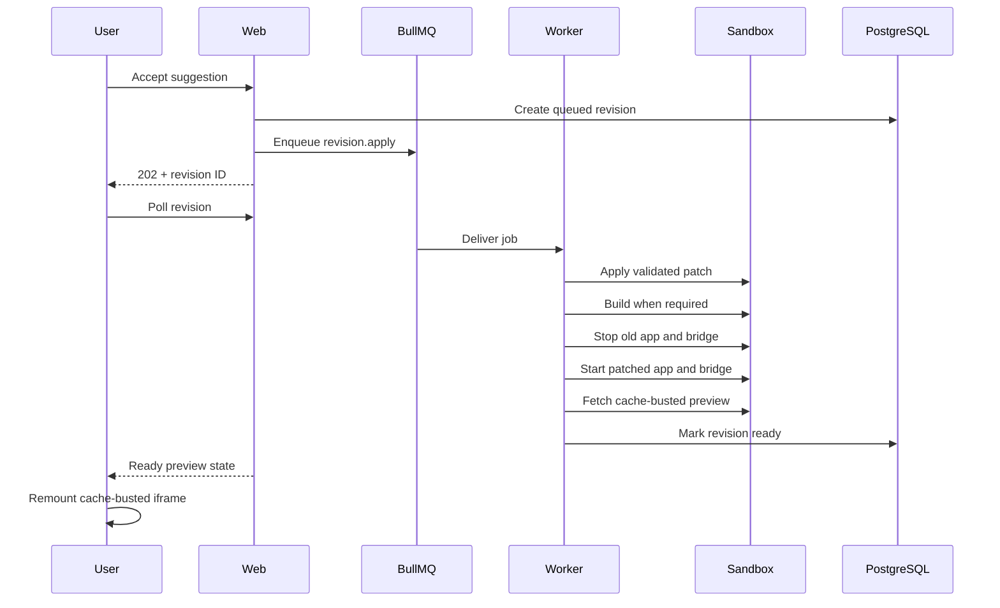

# Architecture

## System objective

Destoc turns rendered interface feedback into a bounded source-code experiment. The system must keep untrusted repository execution separate from application credentials, keep long-running work outside HTTP requests, and never claim a patch is complete until the rebuilt preview is reachable.

## Runtime components

### Web application

The Next.js process owns:

- Better Auth email/password sessions.
- Server-rendered workspace and project pages.
- Ownership-checked route handlers.
- Repository import validation.
- Review-target and selected-element persistence.
- BullMQ job submission.
- Polling APIs for sandbox, review, and revision state.

It does not execute imported repositories or invoke Codex.

### Worker

The Bun worker consumes three BullMQ job types:

- `sandbox.execute`
- `review.execute`
- `revision.apply`

It owns Codex execution, Vercel Sandbox lifecycle operations, patch application, preview rebuilds, verified restarts, and terminal failure persistence. Worker concurrency defaults to one to fit the Oracle free-tier deployment and avoid concurrent use of a personal Codex session.

### PostgreSQL

PostgreSQL is the source of truth for:

- Users, sessions, and workspaces.
- Imported projects.
- Sandbox lifecycle state and logs.
- Review targets and selected DOM evidence.
- Reviews and suggestions.
- Accepted revisions and failure state.

The browser polls persisted domain state rather than BullMQ internals.

### Redis and BullMQ

Redis transports background jobs between the web process and worker. Deterministic job IDs prevent duplicate sandbox/review enqueueing. Terminal job metadata is bounded by age and count. Stalled jobs recover their database state before replay.

### Vercel Sandbox

Each preview is a disposable Node microVM cloned from a public GitHub branch. Dependencies are installed with the repository’s detected package manager. Next.js applications build and start in production mode; generic applications run their `dev` or `start` script.

The sandbox receives no database, authentication, Codex, Redis, or Vercel host credentials.

### Preview bridge

Only the bridge port is public. It:

- Proxies to the application over sandbox loopback.
- Injects component selection, hover labels, and numbered markers.
- Supports WebSocket upgrades for development servers.
- Removes frame-blocking headers.
- Disables service-worker registration and stale browser caching.
- Uses no application credentials or external network APIs.

## Accepted-change lifecycle

Any patch, build, shutdown, restart, or post-change probe failure marks the revision failed and leaves the suggestion retryable.

## Review lifecycle

1. The browser sends selected DOM evidence and component notes.
2. The web process creates a draft review and enqueues it.
3. The worker fetches bounded public source candidates.
4. The provider returns structured JSON containing a summary and up to three suggestions.
5. Patches are normalized and checked against safe source paths.
6. Suggestions and provider results are committed transactionally.
7. The browser renders the provider summary and diff-backed decision cards.

## Security boundaries

- Authentication and ownership checks occur before all user-scoped reads or writes.
- GitHub imports accept only public HTTPS repository URLs.
- Patch paths cannot traverse directories or edit environment/package/lock files.
- The command provider runs read-only and ephemeral with bounded time and output.
- Repository code runs in a separate disposable environment.
- Provider and infrastructure secrets stay in the web/worker containers.
- Production command-provider use requires an explicit enable flag.

## Assumptions

- The imported project is a root-level browser application.
- The repository can install non-interactively from a public package registry.
- The target branch and root page are sufficient for a design review.
- Source-file mapping is evidence-driven but cannot be perfect without framework compiler integration.
- A single worker is adequate for the assignment deployment.
- Temporary sandbox edits satisfy the evaluation; GitHub write-back is not required.

## Trade-offs

### Server Components with focused client islands

Pages and initial data remain server-rendered. The design workspace is client-side because iframe messaging, selection state, pane resizing, polling, and streamed presentation require browser state. This keeps secrets and database access server-side while accepting a larger client bundle for the editor surface.

### Polling over push

Persisted polling is simpler and more recoverable across Coolify restarts than maintaining WebSockets from the application host. It adds periodic requests and up to roughly 1.5 seconds of presentation latency.

### Production Next.js previews

Next.js repositories build and run in production mode to avoid HMR WebSocket failures and partial hydration. This makes startup and accepted patches slower than development mode but produces a more faithful interactive page.

### Best-effort source mapping

DOM evidence and bounded GitHub source candidates provide a pragmatic implementation path. The model can still miss generated or deeply abstracted components; unsafe or malformed diffs are removed rather than guessed.

### Session-local revisions

Changes accumulate within one live sandbox but are not replayed into a new session. This avoids corrupt stale patches and keeps each review reproducible from GitHub source, but users cannot resume an edited sandbox after expiry.

## Failure handling

- Queue submission failure moves the related domain record into a visible failed state.
- Worker crashes are recovered through BullMQ stalled-job handling and database state reset.
- Sandbox startup records bounded install/build/server logs.
- Accepted changes require a stopped old process, successful rebuild when applicable, restarted bridge, and reachable cache-busted preview.
- The UI marks suggestions accepted only after the revision reaches `READY`.
