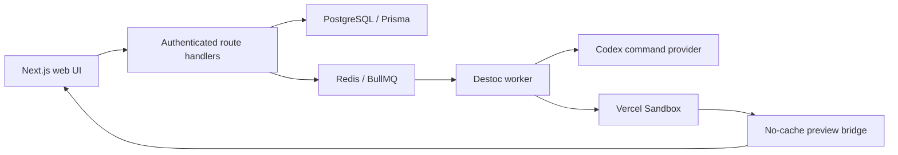

# Destoc

Destoc is a desktop-first AI design-review workspace for public GitHub repositories. A reviewer imports a repository, opens an isolated live preview, selects rendered components, adds notes, asks for a design change, inspects the generated diff, and applies an accepted patch to the running sandbox.

- Live application: [destoc.cooldash.xyz](https://destoc.cooldash.xyz)
- Repository: [github.com/kreatzzz/destoc](https://github.com/kreatzzz/destoc)
- Assignment direction: Option 2 — Mini AI Design Mode
- Submission checklist: [SUBMISSION.md](SUBMISSION.md)
- Detailed architecture: [ARCHITECTURE.md](ARCHITECTURE.md)
- Supported repositories: [SUPPORTED_REPOSITORIES.md](SUPPORTED_REPOSITORIES.md)
- Design system: [DESIGN.md](DESIGN.md)
- AI usage and transcripts: [ai-transcripts/](ai-transcripts/)

## Demo instructions

The hosted app uses a self-serve demo flow rather than shared credentials:

1. Open the [live application](https://destoc.cooldash.xyz).
2. Create an account with an email and password.
3. Import a small public root-level Next.js App Router repository.
4. Open the project, select a rendered component, add an optional note, and
   send a design request.
5. Review the generated code suggestion, accept it, and wait for the sandbox
   preview to rebuild and refresh.

For local evaluation, the seeded account is
`demo@destoc.local` / `DemoPassword123!`. Never use this credential pair in
production.

## Features and core flow

1. Sign up with email and password.
2. Import a public GitHub repository and branch.
3. Start an isolated Vercel Sandbox preview.
4. Select one or more rendered components and attach notes.
5. Ask Destoc for an implementation-focused design review.
6. Inspect the proposed source diff.
7. Accept the suggestion to patch, restart, verify, and refresh the sandbox.

## Architecture



The web process handles authentication, repository management, persisted state, and job submission. A separate BullMQ worker performs long-running sandbox startup, AI review generation, and accepted patch application. PostgreSQL is the source of truth for user-visible job state; Redis is the delivery mechanism, not the system of record.

Imported code runs only inside Vercel Sandbox. The preview bridge proxies the repository over one public port, injects component-selection behavior, disables stale service-worker caching, and never receives Destoc database or provider credentials.

See [ARCHITECTURE.md](ARCHITECTURE.md) for component responsibilities, lifecycle transitions, security boundaries, failure recovery, assumptions, and trade-offs.

## Database schema

The Prisma schema is in [`prisma/schema.prisma`](prisma/schema.prisma). Its main
domains are users/sessions, workspaces/projects, sandbox runs, review targets,
reviews/suggestions, revisions, and optional screenshot/log assets. PostgreSQL
is authoritative; Redis only delivers background jobs.

## Stack

- Next.js App Router, React 19, TypeScript, Tailwind CSS, shadcn/ui
- Bun for package management and the background worker
- PostgreSQL, Prisma 7, Better Auth
- Redis and BullMQ for durable background work
- Vercel Sandbox for isolated repository execution
- Codex command provider for the current private production experiment

## Local setup

Requirements: Bun, Docker, and a Codex login only when using the command provider.

```bash
cp .env.example .env
bun install
docker compose up -d postgres redis
bun run db:deploy
bun run db:seed
```

Run the web application:

```bash
bun run dev
```

Run the worker in a second terminal:

```bash
bun run worker
```

## Verification

```bash
bun run lint
bun run typecheck
bun run test
bun run build
bunx prisma validate
```

## Supported repositories

The strongest end-to-end support is for root-level public Next.js App Router
applications with conventional UI source paths. Root Vite applications are
also previewable, and common `src/App.tsx`, `src/main.tsx`, and `src/index.css`
files are patch-eligible. npm, pnpm, Yarn, and Bun lockfiles are detected and
preserved through installation, build, startup, and accepted-change rebuilds.

Workspace-only monorepos, private repositories, and projects requiring interactive setup are rejected or out of scope. See [SUPPORTED_REPOSITORIES.md](SUPPORTED_REPOSITORIES.md) for the exact compatibility contract and recommended test repositories.

## Security model

- All product records are checked against the authenticated owner server-side.
- Only public HTTPS GitHub repository URLs are accepted.
- Imported code runs in a disposable microVM and receives no application secrets.
- Suggested patches are restricted to safe UI source paths; environment files, package manifests, lockfiles, and traversal paths are rejected.
- Auth, mutation, review, and sandbox operations are rate limited.
- The provider prompt is capped at 100 user-supplied words, including selected-component notes.

## Assumptions

- The evaluation focuses on the design-review loop rather than GitHub collaboration features.
- A repository has one root web application and a runnable root `package.json`.
- Accepted changes are temporary preview experiments, not source-control writes.
- One production web replica and one worker are sufficient for the take-home deployment.
- Codex device authentication is acceptable for a private experiment; it is not presented as a multi-tenant provider gateway.

## Important trade-offs

- **Vercel Sandbox over local Docker execution:** stronger isolation and simpler host security, at the cost of external credentials, startup latency, and provider dependency.
- **BullMQ worker over request-bound execution:** durable long-running work and recoverable UI state, at the cost of a required Redis service and a second deployment process.
- **Fresh repository source per session:** deterministic clean previews, at the cost of not preserving accepted changes between sessions.
- **Anonymous public repository import:** avoids storing GitHub credentials,
  at the cost of excluding private repositories, write-back, and being subject
  to GitHub's unauthenticated API rate limit.
- **Safe bounded diffs:** reduces destructive AI edits, at the cost of rejecting some valid multi-file changes.
- **Command-provider Codex experiment:** enables evaluation without DeepSeek usage, but device sessions can expire and the approach should remain access restricted.

## Deployment

Production uses four resources:

1. `destoc-web`
2. `destoc-worker`
3. PostgreSQL
4. Redis

See [DEPLOYMENT.md](DEPLOYMENT.md) for the Coolify/Oracle setup, environment variables, persistent Codex authentication, and smoke-test sequence.

## Environment variables

Copy [`.env.example`](.env.example) for local development. The complete
production web/worker split and secret placement are documented in
[DEPLOYMENT.md](DEPLOYMENT.md). Do not expose worker-only Codex or Vercel
credentials to imported repositories.

## AI usage

Codex was the AI coding assistant used for architecture, implementation,
debugging, UI iteration, tests, and deployment work. Cursor and OpenCode were
not used. The copied redacted excerpts, curated session records, and manual
decision summary are in [`ai-transcripts/`](ai-transcripts/).

## Current limitations

- DeepSeek remains behind the provider boundary but is not implemented.
- Private repositories, GitHub OAuth, pull requests, webhooks, and repository write-back are deferred.
- Accepted changes affect only the current sandbox session.
- Screenshot persistence requires a browser-capture service and Blob storage.
- Runtime-dependent projects may need per-project environment and egress configuration.
- Repository metadata and source-context fetches use GitHub anonymously and
  can be rate-limited under heavier production use.
- Persisted visual before/after capture is not implemented. The current
  comparison surface is the original session state, the code diff, and the
  live patched preview.

## Future improvements

- Capture and persist before/after screenshots for each accepted revision.
- Add optional authenticated GitHub access, private repositories, and pull
  request write-back.
- Replace personal Codex device authentication with a supported multi-tenant
  provider configuration.
- Add per-project environment/egress configuration and production
  observability for queue, worker, and sandbox health.
